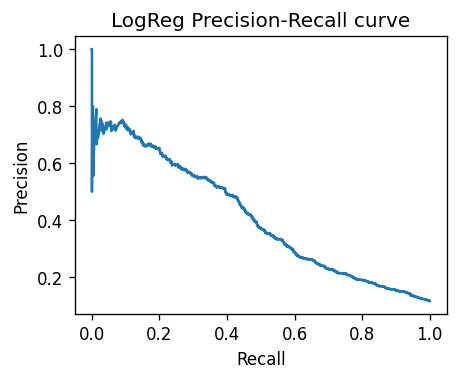

# Baseline Logistic Regression

**Class balance**

- Train positives: 11.698%
- Test  positives: 11.700%

## Metrics (test set)

| Metric | Value |
| ------ | ----- |
| Accuracy | 0.756 |
| Precision | 0.268 |
| Recall | 0.627 |
| F1 | 0.375 |
| ROC-AUC | 0.772 |
| PR-AUC | 0.409 |



### Confusion matrix

```
[[6173 1812]
 [ 395  663]]
```